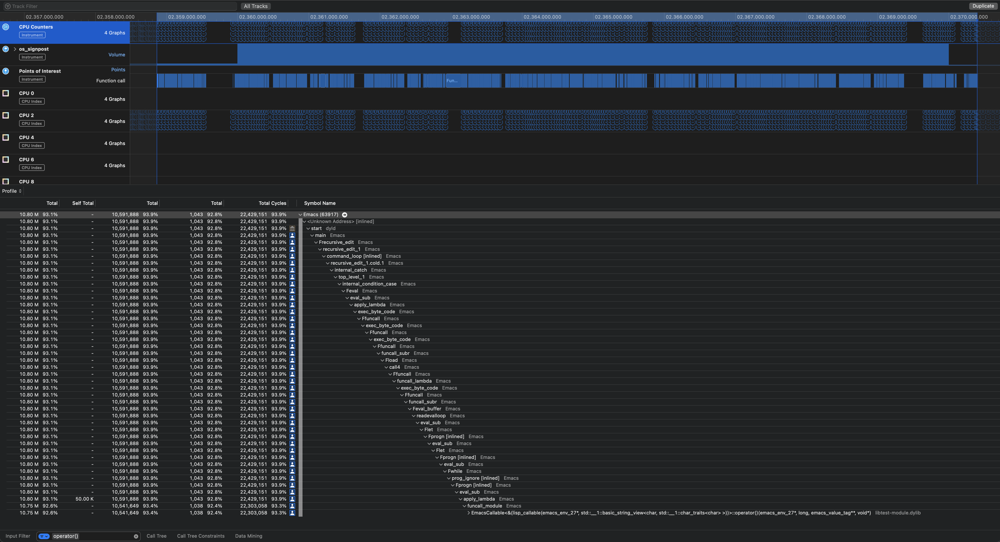

# emacs-module-wrapper-template
This project is motivated by recently writing an Emacs module.  When you define a function in C/C++ that is callable from elisp, there is some boilerplate and manual transformation of function properties when registering the function with Emacs, as well as unpacking parameters.  For a good discussion of writing Emacs modules, see http://diobla.info/blog-archive/modules-tut.html#sec-2-2.  The point of this library is to use template metaprogramming to turn something like this:

```

emacs_value some_C_work_useful_for_Emacs(int a, const string& s, void* data) {

}

emacs_value elisp_callable(emacs_env* env, ptrdiff_t nargs, emacs_value* args, void* data) {
  // Assert nargs contains 1 or 2
  // unpack an int from args with error handling
  // check if nargs == 1 or 2, and unpack a string if it is 2 with error handling
  return some_C_work_useful_for_Emacs(i, s, data);
}

int emacs_module_init(struct emacs_runtime *runtime) noexcept {
    emacs_env* env = runtime->get_environment(runtime);
    emacs_value func = env->make_function(env,
  					  1,  // Minimum parameter count
  					  2,  // Maximum parameter count
  					  elisp_callable,
  					  "Callable function from emacs",
  					  nullptr);  // User data passed to your function
    emacs_value symbol = env->intern(env, "lisp-function-name");
    emacs_value args[] = { symbol, func };
    emacs_value defalias = env->intern(env, "defalias");
    env->funcall(env, defalias, 2, args);
}
```

into something like this:

```
emacs_value lisp_callable(emacs_env* env, const string s, std::optional<int> i) {
  cout << s << endl;
  cout << i.value() << endl;
  return env->intern(env, "nil");
}

EmacsCallable<lisp_callable> c;
int emacs_module_init(struct emacs_runtime *runtime) noexcept {
  c.defineInEmacs(runtime, "emwt-lisp-callable", "Test function", nullptr,
  		  elispCallableFunction<&c>);
  return 0;
}
```

`elispCallableFunction` takes a functor address as a non-type template parameter, and when it is invoked, it invokes the functor.  The functor is generated by the function you provide, and it will unpack arguments and call your function.

## Perf counter analysis

This chart shows a run in Instruments, collecting "Cycles with outstanding L1 misses", "DTLB misses that incur a page walk", and "Total Cycles".  I used the Signposts API to limit to time spent in user-function invocation (i.e. the wrapper function that calls the user function provided by the module).  There is a flaw (or, at least one) in how I collected the numbers, which is that I do not know how to limit perf counter metrics to just time spent between signposts.  I think it requires a custom instrument or more advanced collection.  Therefore, I had to analyze perf counter data from the first sign post to the last one, which includes time the process is context switched out.


Some future optimizations planned are:

* Use a statically-allocated buffer for strings to reduce the need to allocate heap memory during the function invocation.
* When unpacking parameters, figure out a way to unpack them directly into the arguments tuple (similar to emplace functions), instead of returning them and relying on copies being made.

Instruments screen shot


